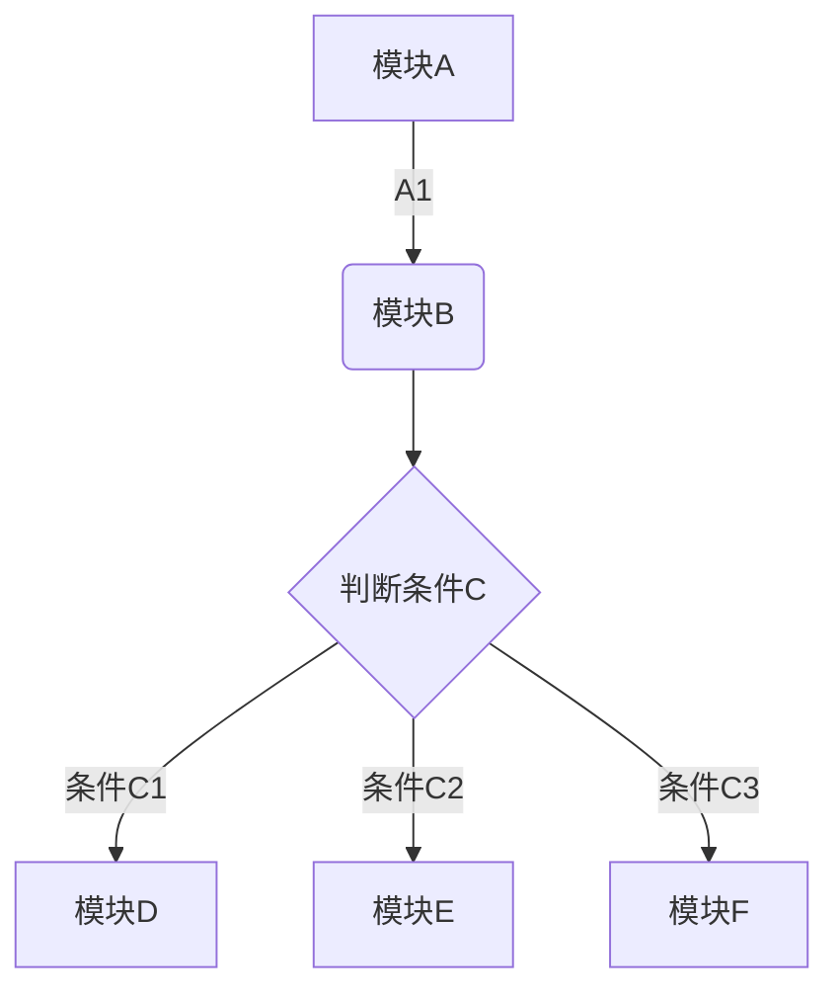
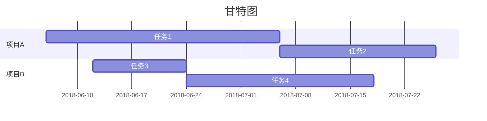
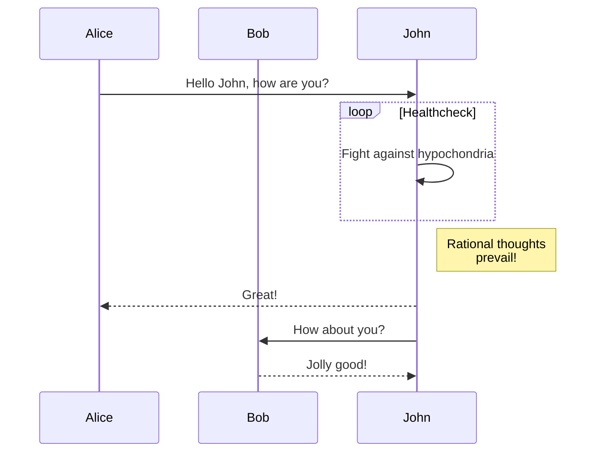
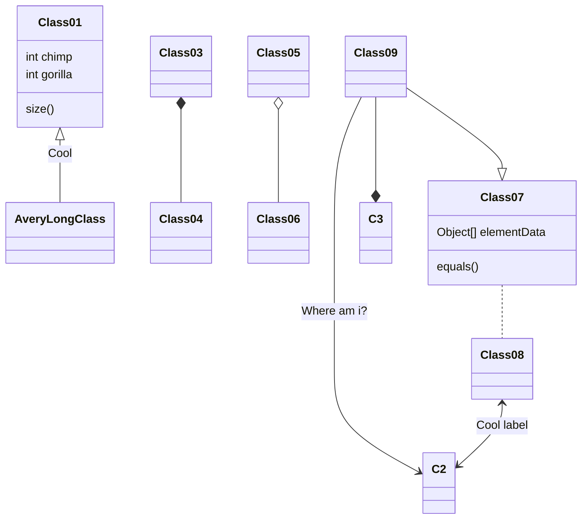
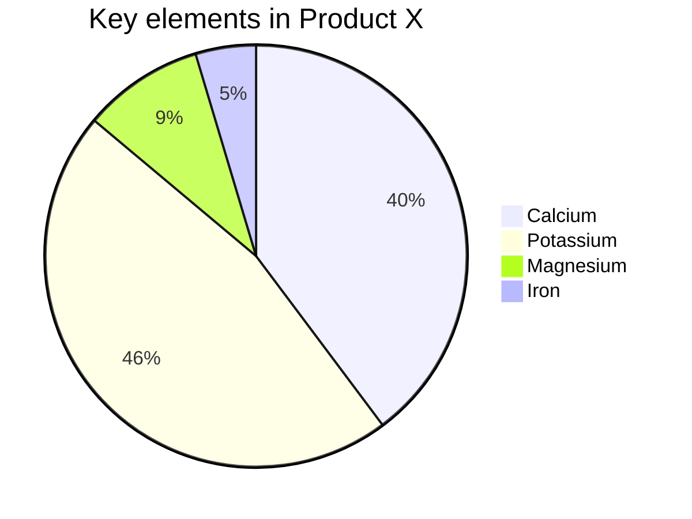
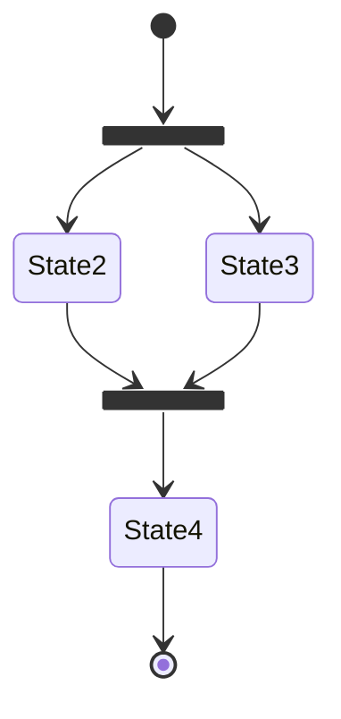

# markdown mermaid 语法

$e^{i\pi} + 1 = 0$

$$e^{i\pi} + 1 = 0$$

---
basic footnote[^1]  
here is an inline footnote[^2](inline footnote)  
and another one[^3]  
and another one[^4]  

[^1]: basic footnote content  
[^3]: paragraph  
[^2]: footnote  
[^4]: footnote content with some [markdown](https://en.wikipedia.org/wiki/Markdown)